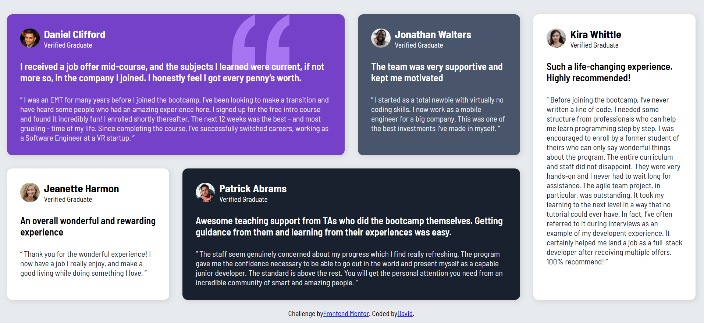

# Frontend Mentor - Testimonials grid section solution

## Table of contents

- [Overview](#overview)
  - [The challenge](#the-challenge)
  - [Screenshot](#screenshot)
  - [Links](#links)
- [My process](#my-process)
  - [Built with](#built-with)
- [Author](#author)

## Overview

### The challenge

Users should be able to:

- View the optimal layout for the site depending on their device's screen size

### Screenshot

### Links

- Solution URL: [Solution URL](https://github.com/davidobeng200/Testimonial-Grid-Section-Main-.git)
- Live Site URL: [Live site URL](https://davidobeng200.github.io/Testimonial-Grid-Section-Main-/)

## My process

### Built with

- Semantic HTML5 markup
- Flexbox
- CSS Grid

## Author

- Website - []DAVID OBENG ADJEI(https://davidobeng200.github.io/Testimonial-Grid-Section-Main-/)
- Frontend Mentor - [@davidobeng200](https://www.frontendmentor.io/profile/davidobeng200)

